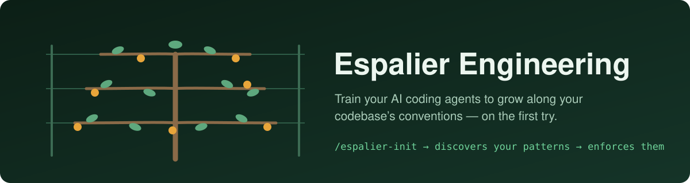
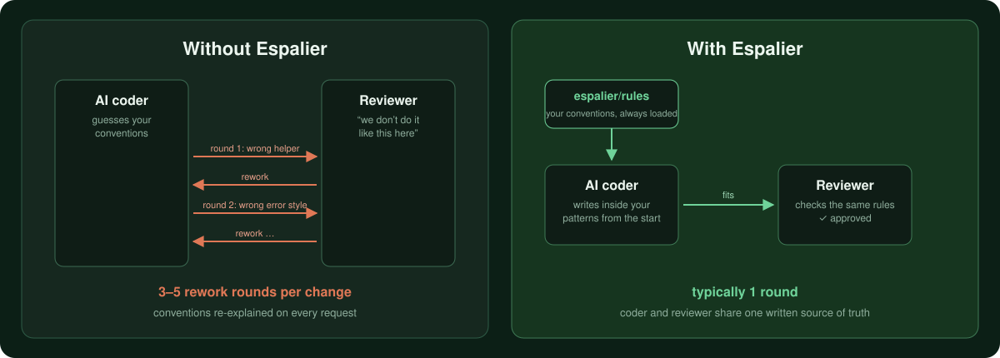
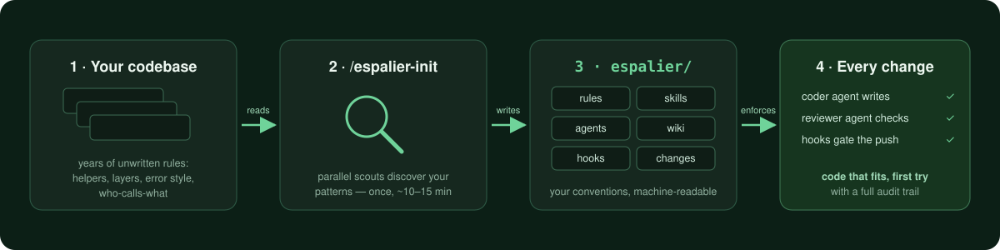

<p align="center">
  
</p>

<p align="center">
  <a href="./CHANGELOG.md"></a>
  <a href="./LICENSE"></a>
  
</p>

An espalier trains a fruit tree to grow flat along a wall — pruned, wired, productive. **Espalier does the same for your AI coding agents:** it reads your codebase, discovers the patterns already in it, and encodes them as machine-enforced guardrails. Generated code grows along *your* conventions on the first try, not the fifth.

## Quick start

```text
/plugin marketplace add Junhanliu-dev/espalier-engineering
/plugin install espalier-engineering@espalier-engineering
/espalier-init
```

That's it. One ~10–15 minute setup per repo, then every future change reuses it.

## The problem

AI coders write plausible code that **doesn't fit your codebase**. They invent helpers you already have, pick libraries you don't use, and `throw` where your repo standardised on `Result<T>` years ago. It's not a model-intelligence problem — it's an **unwritten rules** problem. The model can't read your team's Slack history.

<p align="center">
  
</p>

## How it works

<p align="center">
  
</p>

1. **`/espalier-init` discovers** — parallel scout agents read your code and extract the conventions nobody wrote down.
2. **It writes them down** — as a per-project `espalier/` directory: always-loaded rules, phase-loaded skills, sub-agent definitions, a wiki, and programmatic hooks.
3. **Every change is gated** — a coder agent writes, a *separate* reviewer agent (different tool set) checks against the same rules, and hooks block pushes that skip the gates.
4. **It stays honest** — drift detection flags docs the code has outgrown; refreshes are gated, never silent.

```
espalier/
├── rules/        # always loaded: coding standards, security, production standards
├── skills/       # the pipelines: /espalier, /espalier-fix, /espalier-ask, …
├── agents/       # harness-coder / harness-reviewer / harness-security
├── wiki/         # architecture, data models, critical paths
├── hooks/        # programmatic gates: layer checks, pre-push, drift detect
├── maps/         # multi-session decision maps
└── changes/      # typed audit trail — one folder per requirement
```

## The commands

| Command | What it does |
|---|---|
| `/espalier-init` | One-time setup: discover conventions, generate + wire the guardrails |
| `/espalier <feature>` | Full 10-stage pipeline: grilled requirements → your approval → code → independent review → tests → gated push |
| `/espalier-fix <bug>` | Slimmer bug-fix lane that auto-links each fix to the change that caused it |
| `/espalier-ask <question>` | Read-only Q&A — answers from your docs, verified against the code, every claim sourced |
| `/espalier-audit` | Repo-wide security audit of *existing* code; findings hand off into fix runs |
| `/espalier-simplify [scope]` | Evidence-first simplification survey of *existing* code — proven cuts file as refactor changes the pipeline runs; the docs that described them get flagged for prune |
| `/espalier-map <idea>` | Plan work bigger than one session (epics, greenfield) as a decision map |
| `/espalier-maprun` | Execute a cleared map: headless workers in isolated worktrees, reviewable slice PRs |
| `/espalier-doctor` / `/espalier-prune` | Detect doc drift / refresh a stale doc (gated) |
| `/espalier-migrate` | Upgrade an existing install to the current version |

Highlights along the way:

- **Grilled requirements** — before any code, Stage 1 interrogates the request exactly as hard as its vagueness warrants, then **stops for your explicit sign-off**. Later stages execute a spec they can't misread.
- **Separate judge** — the reviewer is always a different agent with read-only tools. It can't rubber-stamp its own work, and a security auditor joins it on every change's trust boundary.
- **Causal links** — six months later, "why does this feature have 4 fixes against it?" is answered by the audit trail, automatically.
- **Team-ready** — on multi-dev repos, upkeep collapses to one rotating person's ~15-minute weekly job ([how it works](./docs/multi-dev-maintenance-how-it-works.md)).

## Works with your agent — whichever it is

The `espalier/` directory is platform-neutral; init wires it into any subset of:

- **Claude Code** — auto-loaded via `.claude/` symlinks + settings hooks
- **OpenAI Codex** — repo skills, `AGENTS.md` section, `.codex/` agents + hooks ([guide](./docs/codex-integration.md))
- **GitHub Copilot** — Agent Skills, `copilot-instructions.md`, `.github/` agents + hooks ([guide](./docs/copilot-integration.md))

Same rules, same gates, on all three. Add a platform later with one re-wire — nothing is ever unwired.

<details>
<summary><b>Manual / per-project / Codex / Copilot install commands</b></summary>

### Manual git clone + symlink (Claude Code)

```bash
git clone https://github.com/Junhanliu-dev/espalier-engineering ~/repos/espalier-engineering
ln -sfn ~/repos/espalier-engineering/skills/espalier-init ~/.claude/skills/espalier-init
```

Restart Claude Code; update later with `git pull`.

### Project-scoped install

```bash
mkdir -p .claude/skills
ln -sfn /path/to/espalier-engineering/skills/espalier-init .claude/skills/espalier-init
```

### Codex (OpenAI)

```bash
git clone https://github.com/Junhanliu-dev/espalier-engineering ~/repos/espalier-engineering
mkdir -p ~/.agents/skills
ln -sfn ~/repos/espalier-engineering/skills/espalier-init    ~/.agents/skills/espalier-init
ln -sfn ~/repos/espalier-engineering/skills/espalier-migrate ~/.agents/skills/espalier-migrate
```

Restart Codex, run `$espalier-init`, pick **Codex** (or **Both**) at the platform question. After init: restart Codex, trust the project, run `/hooks` once to trust the two quality gates. Pipelines are `$espalier`, `$espalier-fix`, `$espalier-ask`, `$espalier-audit`.

Already ran init from Claude Code? Add Codex wiring without redoing discovery:

```bash
bash ~/repos/espalier-engineering/scripts/bootstrap-espalier.sh \
  --wire-only --platforms=codex \
  --plugin-dir=~/repos/espalier-engineering/skills/espalier-init --yes
```

### GitHub Copilot

```bash
git clone https://github.com/Junhanliu-dev/espalier-engineering ~/repos/espalier-engineering
mkdir -p ~/.copilot/skills
ln -sfn ~/repos/espalier-engineering/skills/espalier-init    ~/.copilot/skills/espalier-init
ln -sfn ~/repos/espalier-engineering/skills/espalier-migrate ~/.copilot/skills/espalier-migrate
```

Reload VS Code (or restart Copilot CLI), run `/espalier-init`, include **GitHub Copilot** at the platform question. Sub-agents are `@harness-coder` / `@harness-reviewer` / `@harness-security`. Add Copilot to an existing install with `--wire-only --platforms=copilot` as above.

</details>

## What it costs

Init is a one-time ~$2–5 on a medium repo (Opus main + Sonnet scouts + cache). Without Espalier, *every* request re-discovers your conventions and burns 3–5 review rounds — you typically earn the init cost back within 5–10 feature requests. Full token/cost breakdown, plan budgets, and per-command cost classes: [docs/usage-cost.md](./docs/usage-cost.md).

**Skip Espalier for:** throwaway prototypes, single-file scripts, solo projects where consistency doesn't matter. For anything you'll iterate on for weeks, it pays back fast.

## Philosophy

> When an agent makes an error, engineer its elimination — not with prompt tweaks, but with files, rules, automated checks, and system structure.

1. **Discover, don't prescribe** — extract patterns from the actual code; never impose templates.
2. **Quality gates must be programmatic** — `ci_status == 'success'`, not "check if CI passes".
3. **Separate execution from judgment** — coder and reviewer are different agents with different tool sets.
4. **Context layering** — rules always loaded; skills per phase; wiki on demand.
5. **Every rule has a reason** — an observed pattern, or a known failure mode it prevents.

## Latest release

**v0.28.0 — the ceiling ledger.** Second idea-level transplant from [DietrichGebert/ponytail](https://github.com/DietrichGebert/ponytail) (MIT), inside the same rule as the first: conventions first, correctness within them, clarity then brevity break ties; **every gate, rubric, verdict sentinel, round cap, and escalation path is contract-equal to v0.27.0, and every new finding is advisory P3.** A deliberate shortcut with a KNOWN ceiling (a global lock, an unbounded scan, a naive heuristic, a cache with no eviction) now carries ONE line at the site — `ceiling: <limit>; <trigger>` — the one comment the budget already allows, so the upgrade path stays attached to the code it constrains instead of buried in a change folder; the reviewer files `[ceiling]` / `[no-trigger]` at P3, `espalier-stats.sh` prints the ledger (`ceilings: markers=N no-trigger=M`, one row per marker with its blame date), and `/espalier-simplify` hands every marker to its scouts as a lead (a fired trigger is a cut or an upgrade change). The ladder's rung 4 opens a shipped `references/platform-native.md` lookup ("you think you need X / the platform has Y") when conventions are silent; the floor keeps physical-world calibration knobs; a fix lands where every caller routes through, never on the reported path alone; the reviewer gains a `shrink:` tag that is invalid whenever the shorter form would draw a Readability row; the grill counts an over-specified mechanism as a signal and lands the requester's choice as a Scope out-line or a kept criterion. No new lane, skill, or command. Migration #38, validation check 70 (60 / 65 / 70 by platform set). Design and the rejected pieces (intensity modes, "ship lazy and question", a one-check test minimum, `net: -N lines`): `docs/ponytail-v4-transplant-plan.md`.

**v0.27.0 — finding the unknowns.** The map (requirements.md) is not the territory (the code); v0.27 gives the pipeline a channel for what the territory teaches during and after implementation — with the contract still frozen and every resolution a human's. The coder logs each departure from an approved criterion under `### Deviations` (the conservative option, the `path:line` contradiction, what was left undone) or stops with `- BLOCKED-ON-REQUIREMENT:` for the human to resolve — it never edits requirements.md; the reviewer's Deviation Review verifies the block every round (`[deviation]` P1), the auditor files a relaxed control as P0, the Stage 4 PASS prints the deviations, Stage 10 presents an assembled `delivery-brief.md` and offers a quiz. Before coding, the grill reads the map to an unfamiliar requester first (Step 1.6, cited, never a proposal), shows its candidate builds at `full` tier, and records an undecided approach instead of choosing; `## References` carries the requester's named model; the approval gate leads with the decisions most likely to change. Contract-equal to v0.26.0 — no gate, rubric, sentinel, or cap changes; nothing sets a budget. Migration #37; validation 59/64/69. Design: `docs/unknowns-plan-v1.md`.

**v0.26.0 — turn economy.** Fewer agent turns and fewer spawns for the same gates, measured on real runs (a coder spawn is ~37 model turns at ~15s each; model latency is flat across context size; the contract phase was a second cold coder spawn that mostly re-verified tests already in the diff). Coders write the abuse test for every sensitive field they classify **with the code** and verify each cycle with ONE call — `exit_gate`, the gate's own commands. The auditor's contract carries `covered_by:` per entry, so a fully covered contract spawns **no contract-phase coder** and goes straight to the delta review, which still proves every entry itself (a `covered_by` that does not hold is its P0). The session-boundary preference is asked once at the approval gate (`- Session-Boundary:`); the Stage 2 and Stage 4 boundaries read it instead of asking. The bash blocks the orchestrator retyped every run are helpers now — `regression_verify`, `record_commits`, `certificate_write`, `drift_index`, `stage85_drift`, `backlink_all`. `exit_gate` scopes monorepo (`(cd WS && CMD) || return 1` per line) and `uv run pytest` test bodies and starts tests as soon as the build is green; the push hook runs build ∥ lint by default. `espalier-stats.sh` shows contract phases covered at Stage 3 vs coder-spawned. Every gate, rubric, sentinel and round cap is contract-equal to v0.25; nothing sets a budget. Design + field data: `docs/pipeline-speed-plan-v4.md`, `docs/pipeline-field-report-2026-09-14.md`.

**v0.25.0 — quality-first context.** Every agent works with its instructions at full strength on current inputs — and **nothing sets a hard budget** (no size cap, no turn cap, no refusal on size, no cap on findings); every gate, rubric, sentinel, and round cap is unchanged. A coder whose task does not fit one spawn hands off at a clean point (`## Handoff` with cited Facts, sentinel `- HANDOFF: true`) and a fresh coder continues from the archived report; the panel still reviews the combined diff once. `coding-report.md` is the current spawn's report with prior spawns in `coding-log/`; requirements split into contract + `requirements-notes.md`; the security contract is extracted to `security-contract.md`; advisory findings are one row each. Spawn lines say the agent body is auto-loaded, a `- Spec applied:` line makes the layer-spec read visible (`[spec-unread]` is advisory), and the pack names Grep-only files and every scoped `CLAUDE.md` / `AGENTS.md` above the touched files — the only path by which a workspace doc reaches a Codex / Copilot coder. The orchestrator offers a fresh session after Stage 2 approval and the Stage 4 PASS (state is already on disk), and runs the Stage 3 exit gate as one `exit_gate` call built from the installed pre-push gate's own commands. The grill's code reads are unlimited. Rules get a Writing Contract, a Removed-rules ledger at the prune gate, a doctor contract-drift line, and a `## Not Precedent` anchor. Coders commit one bounded unit per commit at a clean point, under the project's own commit conventions, and the pipeline never squashes them. The `/espalier` skill is a router whose stage procedures are read at stage entry (`espalier/skills/espalier/stages/`), `pipeline.md` is the stage contract, and the agents' mode-only sections live in `espalier/agents/modes/`, named first on the prompt line that announces the mode. `espalier-stats.sh` reports spawn shape and workspace docs; `scripts/context-report.py` measures an install's context from its transcripts. Details in the [CHANGELOG](./CHANGELOG.md).

Full history and migration guides: [CHANGELOG.md](./CHANGELOG.md) · upgrade any install with `/espalier-migrate`.

## License

MIT — see [LICENSE](./LICENSE).
